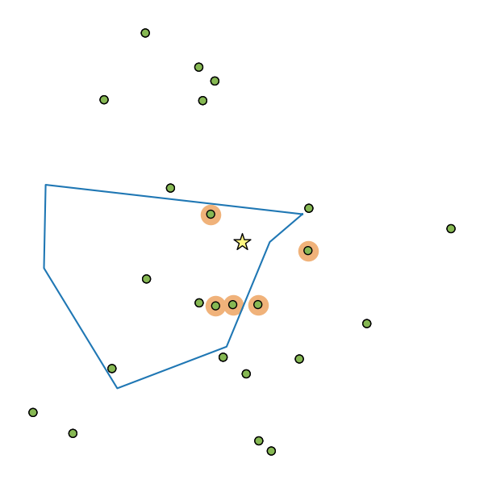
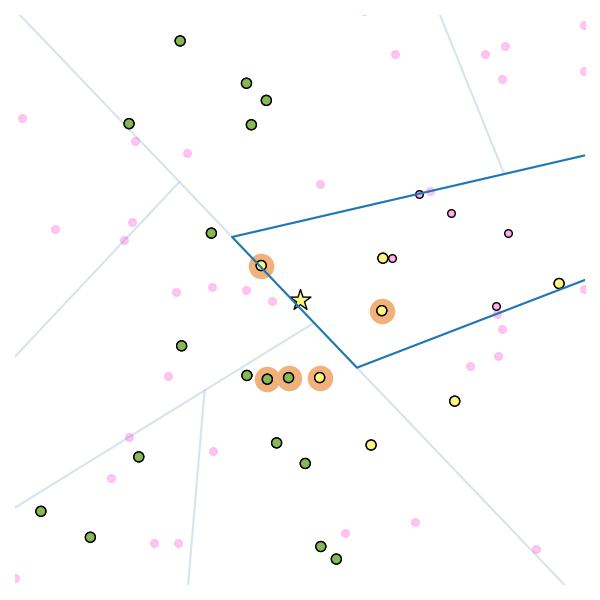
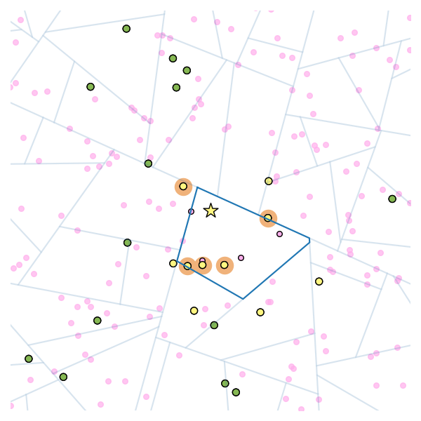
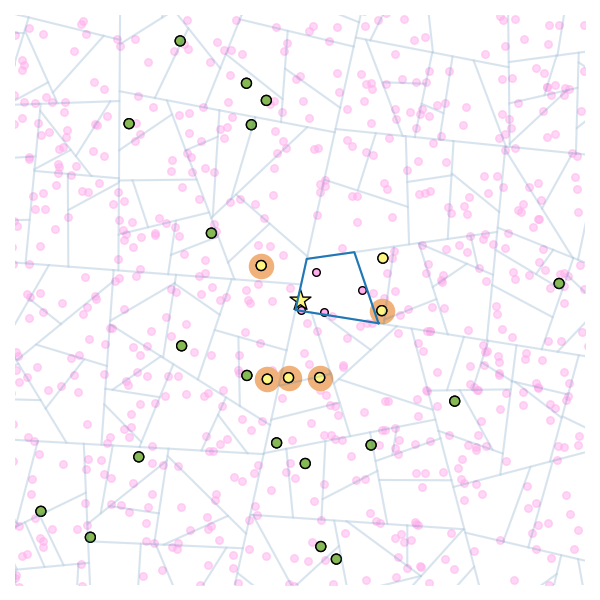

# ANN visualization

Toy examples illustrating the [Multilabel classification framework for approximate nearest neighbor search](https://arxiv.org/abs/1910.08322).

## Illustration of toy data set

To generate a figure of corpus, query point, 5-nn of the query and the partition element, run
```plot-toy-data
./knn_demo.py
```



## Illustration of consistency results

To generate partitions and candidate sets with different training set sizes, run
```plot-consistency
./consistency.py
```
PCA tree with `n=50`:



PCA tree with `n=250`:



PCA tree with `n=1000`:


